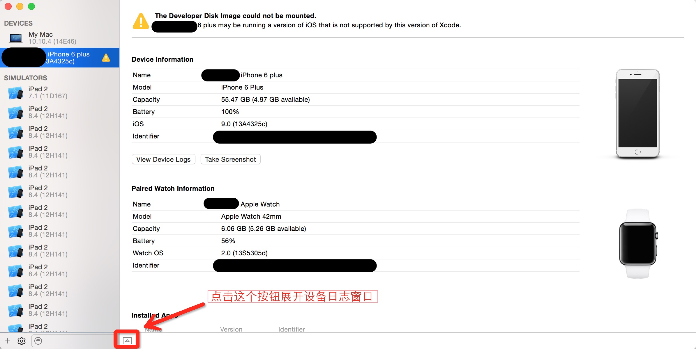

# Bugly iOS SDK 接入指南

## 1. SDK 集成

Bugly 提供两种集成 SDK 方式供 iOS 开发者选择

* CocoaPods

* 手动集成 

### 1.1 CocoaPods 集成方式

在工程的 **Podfile** 里面添加以下代码

```ruby

pod 'Bugly'

```

保存并运行`pod install`,然后用后缀为`.xcworkspace`的文件打开工程

关于`CocoaPods`的更多信息请查看 [CocoaPods官方网站](https://cocoapods.org "CocoaPods") 

### 1.2 手动集成方式

* 下载并解压 [iOS SDK](http://bugly.qq.com/whitebook "iOS SDK") 
* 拖拽`Bugly_libc++`目录下的`Bugly.framework`文件到 Xcode 工程内 （请勾选`Copy items if needed`选项）
* 添加依赖库
	- `SystemConfiguration.framework`
	- `Security.framework`
	- `libz.dylib`
	- `libc++.dylib`

**如果你的 Xcode 工程里的 `C++ Standard Library` 配置为`libstdc++`**

1. 请选择`Bugly_libstdc++`目录下的`Bugly.framework`
2. 并将上述依赖库中的`libc++.dylib`替换为`libstdc++.dylib`

## 2. 初始化SDK

### 1.导入头文件

在工程的`AppDelegate.m`中导入头文件

`#import <Bugly/CrashReporter.h>`

**如果是 Swift 工程，请在对应`bridging-header.h`中导入**

### 2.初始化 Bugly

在工程`AppDelegate.m`的`application didFinishLaunch...`方法中初始化 Bugly

**Objective-C**

```objective-c
- (BOOL)application:(UIApplication *)application didFinishLaunchingWithOptions:(NSDictionary *)launchOptions {
	[[CrashReporter sharedInstance] installWithAppId:@"此处替换为你的AppId"];
	return YES;
}
```
**Swift**

```swift
func application(application: UIApplication, didFinishLaunchingWithOptions launchOptions: [NSObject: AnyObject]?) -> Bool {
	CrashReporter.sharedInstance().installWithAppId("此处替换为你的AppId")
	return true
}
```

### 3.iOS Extension 初始化

如果工程内包含 Extension Target,则初始化方法需要带上共用的 App Group 标识符

**Objective-C**

```objective-c
- (BOOL)application:(UIApplication *)application didFinishLaunchingWithOptions:(NSDictionary *)launchOptions {
	[[CrashReporter sharedInstance] installWithAppId:@"此处替换为你的AppId"  applicationGroupIdentifier:@"此处替换为你的App Group标识符"];
	return YES;
}
```

**Swift**

```swift
func application(application: UIApplication, didFinishLaunchingWithOptions launchOptions: [NSObject: AnyObject]?) -> Bool {
	CrashReporter.sharedInstance().installWithAppId("此处替换为你的AppId" applicationGroupIdentifier:"此处替换为你的App Group标识符")
	return true
}
```

关于 Extension 的接入流程请参见 [Bugly iOS Extension SDK 接入指南](./advanced/EXTENSION.md)

#### 至此，恭喜你的工程已经成功集成 Bugly，接下来编译并运行你的工程吧 ：）


----

##如何确认成功接入 Bugly ？

Bugly 会在 log 中输出关键步骤,为了完成接入检测,请在你的 App 代码中手动构建一个异常,如下述例子

**Objective-C**

```objective-c
- (BOOL)application:(UIApplication *)application didFinishLaunchingWithOptions:(NSDictionary *)launchOptions {
	[[CrashReporter sharedInstance] installWithAppId:@"此处替换为你的AppId"];
	[self performSelector:@selector(crash) withObject:nil afterDelay:3.0];
	return YES;
}
```

**Swift**

```swift
func application(application: UIApplication, didFinishLaunchingWithOptions launchOptions: [NSObject: AnyObject]?) -> Bool {
	CrashReporter.sharedInstance().installWithAppId("此处替换为你的AppId")
	NSObject.performSelector("crash", withObject: nil, afterDelay: 2.0)
	return true
}
```

**请在初始化 Bugly 代码前打开 log 输出**

`- (void)enableLog:(BOOL)enabled;`

**Objective-C**

```objective-c
- (BOOL)application:(UIApplication *)application didFinishLaunchingWithOptions:(NSDictionary *)launchOptions {
	[[CrashReporter sharedInstance] enableLog:YES];
	[[CrashReporter sharedInstance] installWithAppId:@"此处替换为你的AppId"];
	[self performSelector:@selector(crash) withObject:nil afterDelay:3.0];
	return YES;
}
```

**Swift**

```swift
func application(application: UIApplication, didFinishLaunchingWithOptions launchOptions: [NSObject: AnyObject]?) -> Bool {
	CrashReporter.sharedInstance().enableLog(true)
	CrashReporter.sharedInstance().installWithAppId("此处替换为你的AppId")
	NSObject.performSelector("crash", withObject: nil, afterDelay: 3.0)
	return true
}
```
	
**准备步骤**

* 连接 iOS 设备，编译并运行，点击 Xcode 的中止按钮断开调试模式

*编译启动后，点击图片中箭头所指按钮关闭 Xcode 调试模式*


* 进入 Xcode 中的 Devices 选项，选中调试设备并展开设备日志 (入口在Xcode上方菜单栏的`Window` -> `Devices`)



* 重新启动刚才编译的 App 开始关键步骤确认


### 关键步骤 log 输出

**请在设备日志输出的 Log 中查找以下关键字**

- 初始化 SDK

`<WORKFLOW>: init sdk ...`

- 成功安装异常捕获模块

`<WORKFLOW>: sdk install signal handler success, exception handler success`

- 成功向服务器发送请求

`<WORKFLOW>: ******Http request successed`

- 成功捕获异常的输出

`Bugly <INFO>: Catch uncaught exception:`

- 成功持久化异常信息

` Bugly <INFO>: save one crash`

- 成功将异常上报至服务器

`Bugly <INFO>:  CrashUploadHandler SUCC finish crash uploading. with 1 records and 1 crashes`

**如果上述关键步骤 log 都能找到，即可到 Bugly 官网 *崩溃列表* 处查看新上报的异常信息了**

- 有其他第三方 SDK 抢注了系统崩溃捕获接口

`<WARN> Bugly: Note: there is another uncaught exception handler ...`

**如果在日志中见到上行记录，请先手动调用存在崩溃捕获能力的第三方 SDK 的关闭接口，最后再初始化Bugly**

**如示例：关闭 友盟，TalkingData，Testin 相关能力的代码：**

**Objective-C**

```objective-c
- (BOOL)application:(UIApplication *)application didFinishLaunchingWithOptions:(NSDictionary *)launchOptions {
//    友盟
    [MobClick setCrashReportEnabled:NO];
    [MobClick startWithAppkey:@"UMENG_APPKEY"];
//    talking data
    [TalkingData sessionStarted:@"TALKINGDATA_APPID" withChannelId:nil];
    [TalkingData setExceptionReportEnabled:NO];
    [TalkingData setSignalReportEnabled:NO];
//    testin
    TestinConfig *config = [TestinConfig defaultConfig];
    config.enabledMonitorException = NO;
    [TestinAgent init:@"TESTIN_APPID" channel:nil config:config];
//    初始化Bugly
    [[CrashReporter sharedInstance] enableLog:YES];
    [[CrashReporter sharedInstance] installWithAppId:@"BUGLY_APPID"];
    return YES;
}
```
	
**如果第三方SDK不在上述例子中，请查阅第三方SDK头文件或文档找到相应关闭接口进行关闭，如找不到相应接口，请尝试延迟初始化 Bugly**

**Objective-C**

```objective-c
- (BOOL)application:(UIApplication *)application didFinishLaunchingWithOptions:(NSDictionary *)launchOptions {
	 //第三方SDK初始化
	 
	 //延迟3秒初始化Bugly
    [self performSelector:@selector(setupBugly) withObject:nil afterDelay:3];
    return YES;
}

- (void)setupBugly {
    [[CrashReporter sharedInstance] enableLog:YES];
    [[CrashReporter sharedInstance] installWithAppId:@"BUGLY_APPID"];
}
```
	
**如按照上述步骤确认成功仍无法正常上报，请联系客服协助解决**


## 高级功能

Bugly 提供了众多功能强大的模块供开发者开启，如

- 符号还原

- 卡顿监测

- 自动上传符号表

- 异常回调..等

#### 关于Bugly更多高级功能的使用，请移步 [Bugly高级功能使用指南](./advanced/ADVANCED.md)

