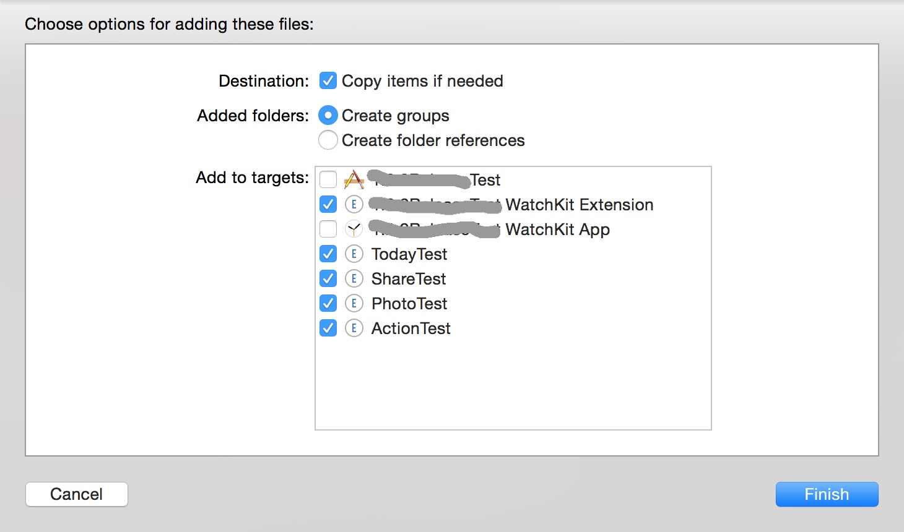

# Bugly iOS Extension SDK 接入指南

## 1. 集成 SDK 

**注意：BuglyExtension 依赖于 `Bugly iOS SDK 1.2.9` 及以上版本**

BuglyExtension 提供两种集成 SDK 的方式供 iOS 开发者选择

* CocoaPods  

* 手动集成 

### 1.1 CocoaPods 集成方式

在工程的 **Podfile** 里对应的 Extension Target 中添加以下代码

`pod 'BuglyExtension'`

示例：

	target 'ExtensionPodTest WatchKit Extension' do
		pod 'BuglyExtension'
	end

保存并运行`pod install`,然后用后缀为`.xcworkspace`的文件打开工程

关于`CocoaPods`的更多信息请查看 [CocoaPods官方网站](https://cocoapods.org "CocoaPods") 

### 1.2 手动集成方式

* 下载并解压 [iOS Extension SDK](http://bugly.qq.com/sdkdown?id=05deedf8-796e-4e95-9d1d-3bb3d9890e78 "iOS Extension SDK") 

* 拖拽`BuglyExtension.framework`文件到 Xcode 工程内 (如下图)
	- **请勾选`Copy items if needed`选项**
	- **如有多个 Extension Targets ,则一一进行勾选**

---

## 2. 初始化 SDK

### 1.导入头文件

在工程的`InterfaceController.h`中导入头文件

`#import <BuglyExtension/CrashReporterLite.h>`

**如果是其它类型的 Extension，请在对应的入口`ViewController.h`中导入**

**如果是 Swift 工程，请在对应的`bridging-header.h`中导入**

### 2.初始化 BuglyExtension SDK

#### 2.1 Watch Extension

在工程`InterfaceController.m`的`- (instancetype)init`方法中初始化 Bugly Extension SDK

如果 Xcode 初始模板没有此方法，直接复制以下代码粘贴即可

**Objective-C**

	- (instancetype)init {
    	self = [super init];
    	if (self) {
        	[CrashReporterLite startWithApplicationGroupIdentifier:@"此处替换为您的 App Group Identifier"];
    	}
    	return self;
	}

**Swift**

    override init() {
        CrashReporterLite.startWithApplicationGroupIdentifier("此处替换为您的 App Group Identifier")
        super.init()
    }

**如果 Apple Watch App 中还有 Glance 或 Notification 交互实现，则需在各自的入口`Controller`中添加上述代码。**
    
#### 2.2 其它类型 Extension

其它类型的 iOS Extension，如 Today Extension,Share Extension 等，请在对应的`ViewController.m`的`- (instancetype)initWithCoder`方法中初始化

如果 Xcode 初始模板没有此方法，直接复制以下代码粘贴即可
    
**Objective-C**

	- (instancetype)initWithCoder:(NSCoder *)aDecoder {
    	self = [super initWithCoder:aDecoder];
    	if (self) {
        	[CrashReporterLite startWithApplicationGroupIdentifier:@"此处替换为您的 App Group Identifier"];
    	}
    	return self;
	}

**Swift**

    required init(coder aDecoder: NSCoder) {
    	CrashReporterLite.startWithApplicationGroupIdentifier("此处替换为您的 App Group Identifier")
        super.init(coder: aDecoder)
    }
    
#### 2.3 Host App 中的初始化

BuglyExtension SDK 依赖于 `Bugly iOS SDK 1.2.9` 及以上版本。

如需支持 Extension 的异常捕获，在 Host App 中的初始化方法需要变更为以下方法：

**Objective-C**

	- (BOOL)application:(UIApplication *)application didFinishLaunchingWithOptions:(NSDictionary *)launchOptions {
		[[CrashReporter sharedInstance] installWithAppId:@"此处替换为你的AppId"  applicationGroupIdentifier:@"此处替换为你的App Group标识符"];
		return YES;
	}

**Swift**

	func application(application: UIApplication, didFinishLaunchingWithOptions launchOptions: [NSObject: AnyObject]?) -> Bool {
		CrashReporter.sharedInstance().installWithAppId("此处替换为你的AppId" applicationGroupIdentifier:"此处替换为你的App Group标识符")
		return true
	}

#### 至此，恭喜您的工程已经成功集成 BuglyExtension SDK，接下来编译并运行您的工程吧 ：）
